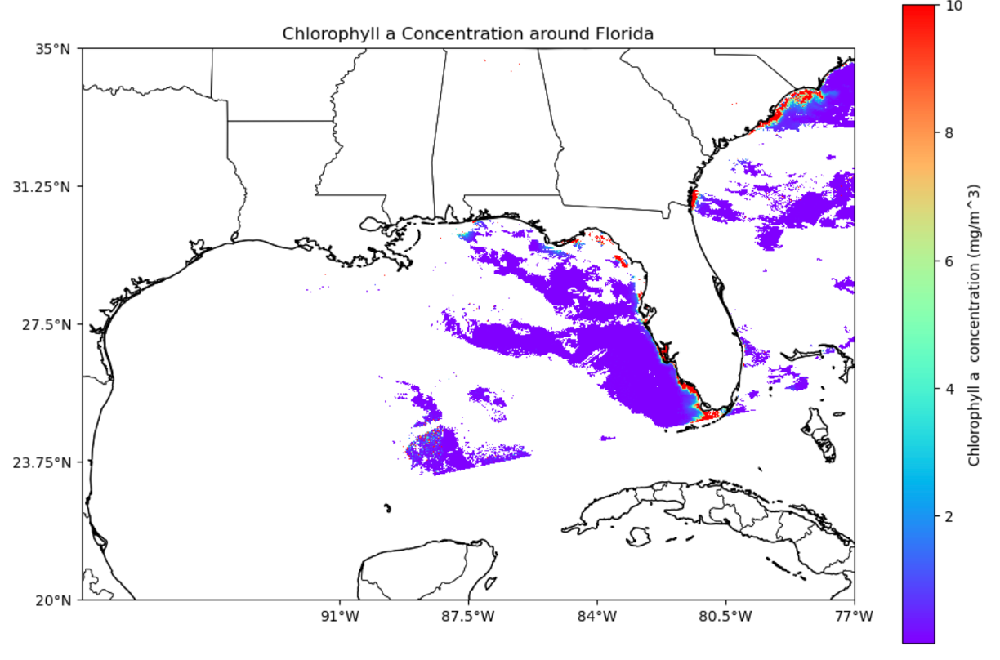

# Downloading-of-NASA-PACE-Image-data-using-our-STS-Customized-HyperCoast-Software
The Science and Technology Society (STS) of Sarasota-Manatee Counties, Florida have created a few Jupyter Notebooks used to download PACE data and then process and display this new PACE hyperspectral data. 

Florida faces some stiff challenges in dealing the old problem of Red Tide (Karenia brevis). When this algal bloom drifts toward our shorelines, we have problems. Red Tide gives off a toxic vapor that attacks the lungs, kills the fish and other aquatic wildlife and have a huge negative impact on the economy and tourism. Yes, Red Tide has been around for millions of years, but what can we do to mitigate the impact now? Is it possible for us to at least identify and track these Harmful Algal Blooms (HAB) as an early warning system? STS and our citizen scientists would like to be a part of the solution?    

It just so happens that NASA has just launched a new satellite called PACE (Plankton, Aerosol, Cloud Ocean Ecosystem) with hyperspectral data that focuses on our ocean ecosystem and microscopic algae called phytoplankton including the Red Tide species. PACE data is hyperspectral data in that each pixel in a PACE image has 184 channels of spectral data from 339nm in the UV range to 719nm in the near red edge of the visible spectrum. This is a lot of data. Open Geospatial Solutions has a new project called HyperCoast that can be used to download the PACE data that you need with your geographic coordinates, requested dates and cloud cover. After the download, you can view individual channel data on interactive maps or even view the wavelength spectrum for each pixel that you request. HyperCoast works extremely well. In addition, we can then use then use the HyperCoast data structure to calculate your own indices such as Chlorophyll a and possibly Red Tide algal bloom locations for the requested PACE data. 

1) We have created a Jupyter Notebook so that you too can download PACE data use HyperCoast features to view and process the data. In addition, we have extracted the source code and run it directly in each Jupyter notebook cells to better understand how the actual source code is used to view the PACE data and then use these data to calculate Chlorophyll a and in time Red Tide blooms. 

2) We have also created a Jupyter Notebook called 1_netCDF4_PACE_Earth_Data_Visualize_brie_ver6.ipynb that uses HyperCoast to download the data, but then uses the NetCDF .nc file structure that allows for a more straight forward, pythonic approach to working with PACE data. 

We also have included the original PACE Access Data notebook proposed from the Ocean Color Instrument (OCI).

**Authors:** Anna Windle (NASA, SSAI), Ian Carroll (NASA, UMBC), Carina Poulin (NASA, SSAI)

> **PREREQUISITES**
>
> This notebook has the following prerequisites:
> - An **<a href="https://urs.earthdata.nasa.gov/" target="_blank">Earthdata Login</a>**
>   account is required to access data from the NASA Earthdata system, including NASA ocean color data.
> - There are no prerequisite notebooks for this module.
