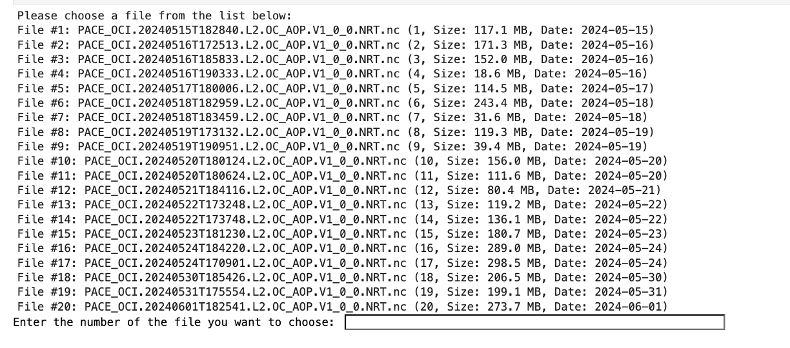

# Downloading NASA PACE Image Data Using STS Customized Hyperspectral Software

## Overview
The Science and Technology Society (STS) of Sarasota-Manatee Counties, Florida, has developed a series of Jupyter Notebooks to facilitate the downloading, processing, and visualization of PACE hyperspectral data from NASA. These tools have a long term goal of addressing the significant challenge of Red Tide (Karenia brevis) in Florida, which has severe impacts on health, marine life, and the local economy.

## Background
Red Tide is an algal bloom that releases toxic vapors, affecting respiratory health, killing marine wildlife, and damaging the tourism industry. Although Red Tide has existed for millions of years, advancements in technology, specifically through NASA's PACE (Plankton, Aerosol, Cloud, Ocean Ecosystem) satellite, offer new opportunities to identify and potentially track these Harmful Algal Blooms (HABs). This is work in progress.

### PACE Satellite
NASA's PACE satellite provides hyperspectral data focusing on ocean ecosystems and phytoplankton, including Red Tide species. Each pixel in a PACE image contains 184 channels of spectral wavelength data ranging from 339nm (UV) to 719nm (near red edge of the visible spectrum). These data is stored in netCDF4 format (.nc files) and are accessible through NASA's [EarthData](https://urs.earthdata.nasa.gov/) website. You will to create your own EarthData account to download data.

        Wavelengths: [315 316 318 320 322 325 327 329 331 334 337 339 341 344 346 348 351 353
         356 358 361 363 366 368 371 373 375 378 380 383 385 388 390 393 395 398
         400 403 405 408 410 413 415 418 420 422 425 427 430 432 435 437 440 442
         445 447 450 452 455 457 460 462 465 467 470 472 475 477 480 482 485 487
         490 492 495 497 500 502 505 507 510 512 515 517 520 522 525 527 530 532
         535 537 540 542 545 547 550 553 555 558 560 563 565 568 570 573 575 578
         580 583 586 588 591 593 596 598 601 603 605 608 610 613 615 618 620 623
         625 627 630 632 635 637 640 641 642 643 645 646 647 648 650 651 652 653
         655 656 657 658 660 661 662 663 665 666 667 668 670 671 672 673 675 676
         677 678 679 681 682 683 684 686 687 688 689 691 692 693 694 696 697 698
         699 701 702 703]

## STS Tools and Methodology
STS uses Geospatial Solution's HyperCoast software to download PACE data. We use HyperCoast because it does show the footprint of available data prior to downloading. The user can then choose the PACE data they want for their analysis from the list of available data.

>

The user can then visualize individual channel data in maps at a particular wavelength or analyze the entire wavelength spectrum for any pixel on the map using Python. We have also developed custom indices, such as Chlorophyll a, to enhance our analysis capabilities. Our ultimate goal is to detect and track Red Tide algal blooms using PACE data. We have a lot to learn on this subject. 

### Jupyter Notebook
We have created a Jupyter Notebook that allow users to:
1. Download PACE data using HyperCoast.
2. Process and visualize the data in Python.

This notebook provide a guide for users to access and analyze hyperspectral data, and hopefully contributing to the early detection and tracking of Harmful Algal Blooms (HABs) in the near future.

## Example Outputs
Below are examples of the outputs you can generate using our notebooks:

```python
def Map_Reflectance(target_wavelength):
        wavelength_index = np.argmin(np.abs(wavelengths - target_wavelength))
        reflectance_at_target = reflectance_data[:, :, wavelength_index]
        
        # Plot the reflectance
        plt.figure(figsize=(12, 8))    
        map_projection = ccrs.PlateCarree()
        ax = plt.axes(projection=map_projection)
        ax.set_extent([-98, -77, 20, 35], crs=ccrs.PlateCarree())  # Florida region
        
        # Plot the reflectance data using pcolormesh
        im = ax.pcolormesh(lon, lat, reflectance_at_target, cmap='rainbow')
        ax.coastlines(resolution='10m')
        ax.add_feature(cartopy.feature.STATES, linewidth=0.5)
        
        # Set ticks and format them
        ax.set_xticks(np.linspace(-91, -77, 5), crs=map_projection)
        ax.set_yticks(np.linspace(20, 35, 5), crs=map_projection)
        lon_formatter = LongitudeFormatter(zero_direction_label=True)
        lat_formatter = LatitudeFormatter()
        ax.xaxis.set_major_formatter(lon_formatter)
        ax.yaxis.set_major_formatter(lat_formatter)
        
        plt.colorbar(im, label=f'Reflectance at {target_wavelength} nm')
        plt.title(f'Reflectance at {target_wavelength} nm around Florida')
        plt.show()

Map_Reflectance(target_wavelength=430)
```


>
>*Example of 430nm Reflectance map.*
---

>
>*Example of a Chlorophyll a concentration map.*
---


```python
def plot_wavelength(target_latitude, target_longitude):
        # Find the closest grid point to the target latitude and longitude
        lat_idx, lon_idx = find_closest_grid_point(latitudes, longitudes, target_latitude, target_longitude)
        
        # Extract reflectance data for the grid point across all wavelengths
        reflectance_spectrum = reflectance_data[lat_idx, lon_idx, :]
        
        # Ensure the dimensions match
        print(f"Wavelengths shape: {wavelengths.shape}")
        print(f"Reflectance spectrum shape: {reflectance_spectrum.shape}")
        
        # Plot reflectance vs. wavelength
        plt.figure(figsize=(12, 6))
        #plt.plot(wavelengths, reflectance_spectrum, marker='o',color='red')
        plt.plot(wavelengths, reflectance_spectrum,color='red',linewidth=3)
        #plt.yscale('log')
        plt.ylim(0,0.02)
        plt.xlim(300,1000)
        
        plt.xlabel('Wavelength (nm)')
        plt.ylabel('Reflectance')
        plt.title(f'PACE Reflectance Spectrum at Lat: {latitudes[lat_idx, lon_idx]}, Lon: {longitudes[lat_idx, lon_idx]}')
        
        # Edge colors picked from image below and sent to Mike 
        plt.axvspan(300, 400, alpha=0.5, color='purple',label='Near UV from 300-400m')
        plt.axvspan(400, 450, alpha=0.5, color='violet',label='Violet 400-450m')
        plt.axvspan(450, 495, alpha=0.2, color='blue',label='Blue from 450-495nm')
        plt.axvspan(495, 550, alpha=0.2, color='green',label='Green from 495-550nm')
        plt.axvspan(550, 590, alpha=0.2, color='yellow',label='Yellow from 550-590nm')
        plt.axvspan(590, 630, alpha=0.2, color='orange',label='Orange from 590-630nm')
        plt.axvspan(630, 700, alpha=0.2, color='red',label='Red from 630-700nm')
        plt.axvspan(700, 1000, alpha=1, color='lavender',label='Near IR from 700-1,000nm')
        plt.legend(bbox_to_anchor=(1.05, 1), loc='upper left', borderaxespad=0.)
        
        plt.grid(True)
        plt.show()

plot_wavelength(target_latitude = 25.3280 , target_longitude = -83.9747)
```

>
>*Example of a wavelength spectrum for a specific pixel.*
---


## Additional Resources
The repository also includes the original PACE Access Data notebook, as proposed by the Ocean Color Instrument (OCI), for users who wish to explore further:

    Authors: Anna Windle (NASA, SSAI), Ian Carroll (NASA, UMBC), Carina Poulin (NASA, SSAI)

This is the original Notebook supplied by NASA. 
---

By using these tools, STS and citizen scientists aim to be part of the solution in detecting, tracking and hopefully mitigating the impacts of Red Tide through advanced hyperspectral data analysis.


> **PREREQUISITES**
>
> This notebook has the following prerequisites:
> - An **<a href="https://urs.earthdata.nasa.gov/" target="_blank">Earthdata Login</a>**
>   account is required to access data from the NASA Earthdata system, including NASA ocean color data.
> - There are no prerequisite notebooks for this module.
